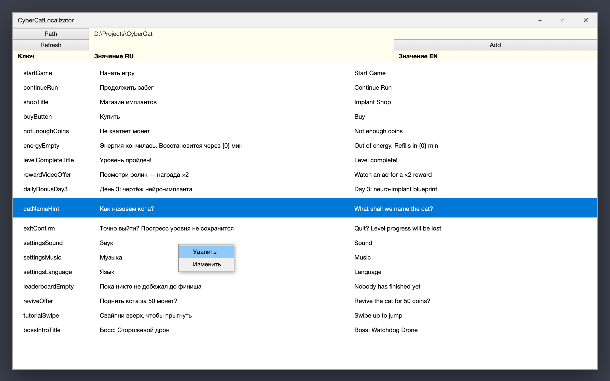
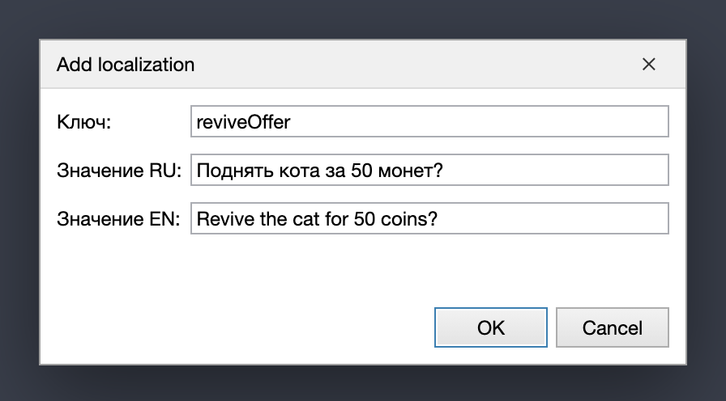

# CyberCat Localizator

*[English version](README.md)*

Небольшой десктопный инструмент под Windows, который превращает локализацию Unity из «правь два JSON
руками и надейся» в нормальную двуязычную таблицу — и заодно генерирует C#-энам ключей, так что
опечатка становится ошибкой компиляции, а не пустой надписью в собранной игре.

Написан для мобильной игры **CyberCat** в небольшой игровой студии (на тот момент — дочерней компании
Mail.Ru Group) и использовался в работе.

---

## Проблема

В Unity нет вменяемого встроенного процесса локализации. На CyberCat строки лежали там, где они
обычно и лежат — JSON в `StreamingAssets`, по файлу на язык:

```
Assets/StreamingAssets/Localization/ru.json
Assets/StreamingAssets/Localization/en.json
```

Каждая новая строчка текста означала «открой оба файла руками». Вот на что уходило время:

- **Переводчик работал вслепую.** Ему отдавали `en.json`, он видел `reviveOffer` и английскую строку —
  без русского оригинала рядом, без экрана, к которому она относится, без понимания, это подпись на
  кнопке (максимум три слова) или реплика в диалоге. Контекст жил у кого-то в голове, а вопросы
  возвращались сообщениями в чат.
- **Файлы расходились.** Добавил ключ в `ru.json`, забыл про `en.json` — и в английской сборке пусто.
  Это не ловит никто: ни компилятор, ни редактор. Находится на плейтесте. Или игроком.
- **Один лишний символ ломал всё.** Неэкранированная кавычка или перенос строки, вставленный в
  значение, — это невалидный JSON: парсинг падает, и умирает **весь** язык целиком, а не одна строка.
- **Ключи были магическими строками.** В коде игры — `Localization.Get("reviveOffer")`. Ошибся в
  букве — получил тишину в рантайме: ни ошибки, ни предупреждения, просто пустая надпись.
- **Ключи не всегда были валидными идентификаторами.** Пробелы и кириллица проникали внутрь, и это
  закрывало любую возможность сгенерировать из них что-то типизированное.

## Решение

Localizator указывают на корень Unity-проекта, и он открывает оба языковых файла как одну таблицу —
ключ, русский, английский в одной строке, — так что переводчик видит оригинал и перевод рядом, а
отсутствующая пара бросается в глаза сразу, а не на плейтесте.

Добавление и редактирование идут через диалог, который валидирует ключ прямо при вводе (только
латиница и цифры, не начинается с цифры, пробелы сворачиваются в camelCase) и пишет оба JSON за один
шаг, экранируя кавычки и переносы строк, — файлы остаются парсящимися.

При каждом сохранении он ещё и перегенерирует два C#-файла внутри Unity-проекта: энам `LocKeys` и
класс `LocDataTexts` с полем на каждый ключ. Это превращает любой ключ локализации в символ времени
компиляции: автодополнение в IDE и ошибка сборки в тот же момент, когда ключ переименовали или
удалили.

---

## Как это выглядит



Полная таблица ключей, оба языка сразу. Правый клик по строке — изменить или удалить; `Path` выбирает
корень Unity-проекта, `Refresh` перечитывает файлы с диска и переписывает сгенерированный C#.



Добавление ключа. Недопустимые символы отсекаются на нажатии клавиши, оба языка обязательны — создать
наполовину переведённый ключ по случайности не получится.

---

## Как подключить

1. Склонируй репозиторий и открой `Localizator.sln` в Visual Studio 2019+ или JetBrains Rider
   (Windows, .NET Framework 4.7.1).
2. Собери проект — NuGet подтянет единственную зависимость, `Newtonsoft.Json`.
3. Запусти `Localizator.exe`, нажми **Path** и выбери корень своего Unity-проекта (папку, внутри
   которой лежит `Assets/`).
4. Путь запоминается между запусками — при следующем старте таблица загрузится сразу.
5. Добавляй, меняй и удаляй ключи: каждое изменение тут же пишет `ru.json`, `en.json`, `LocKeys.cs` и
   `LocDataTexts.cs`.

### Что инструмент ожидает в Unity-проекте

```
<корень проекта>/
├── Assets/StreamingAssets/Localization/ru.json      ← читается и пишется
├── Assets/StreamingAssets/Localization/en.json      ← читается и пишется
└── Assets/Scripts/Localization/
    ├── LocKeys.cs                                   ← генерируется
    └── LocDataTexts.cs                              ← генерируется
```

Формат JSON — объект `texts` с плоскими парами ключ/значение:

```json
{
  "texts": {
    "startGame": "Начать игру",
    "reviveOffer": "Поднять кота за 50 монет?"
  }
}
```

Что генерируется:

```csharp
namespace Viktoriaplus.CyberCat.Localization {
    public enum LocKeys {
        startGame = 0,
        reviveOffer = 1,
    }
}
```

Оба пути и неймспейс генерируемых файлов зашиты под структуру проекта CyberCat — чтобы приспособить
инструмент к другому проекту, достаточно поправить строковые константы в `MainWindow.xaml.cs`.

---

## Кто пользовался и что это дало

Инструментом пользовались переводчики студии — напрямую, вместо того чтобы получать на руки сырой
JSON. Русский оригинал и английский перевод в одной строке убрали тот самый круг «а что эта строка
значит, где она вообще появляется», который раньше возвращался вопросами в чат по заметной доле
строк.

Для разработчиков главным выигрышем оказался сгенерированный энам `LocKeys`. Как только ключи
локализации стали символами, а не строковыми литералами, переименованный или удалённый ключ начал
ломать сборку сразу — вместо того чтобы уехать в релиз пустой надписью. Класс багов, который раньше
находили на плейтесте (а иногда и после релиза), перестал доходить до плейтеста вообще.

А два языковых файла перестали расходиться — просто потому, что отредактировать один без другого
стало нельзя.

---

## Стек

C# · WPF · .NET Framework 4.7.1 · Newtonsoft.Json 12.0.3 · только Windows
